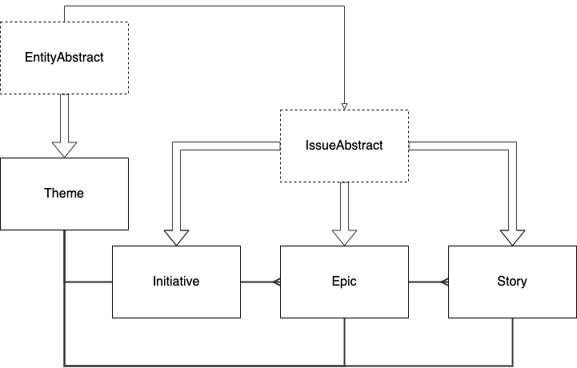
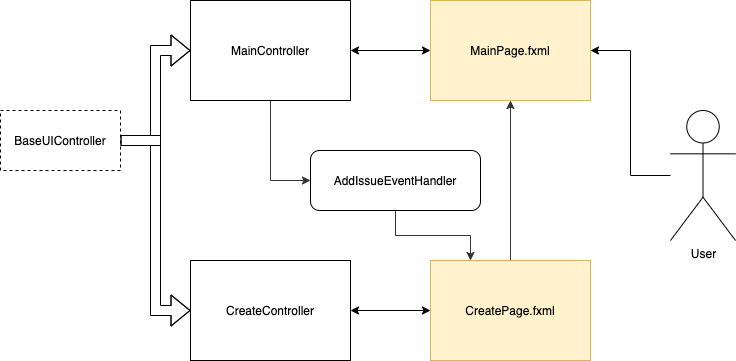
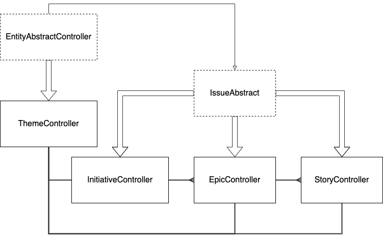
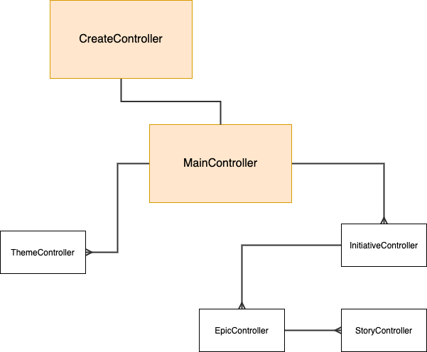
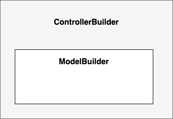
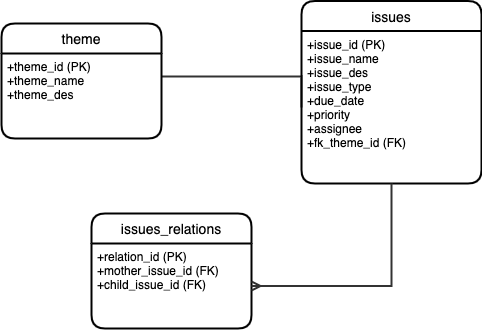

# Agile diary in Java FX

This is a Java FX desktop application 
that stands for managing project using [Agile](https://www.atlassian.com/agile/project-management/epics-stories-themes)
methodology.

## Requirements

Tou need to know **how to work with Java** and **JavaFX**.
Also, you might require [Docker](https://www.docker.com/) installed. 

## Problem

Since there are lots of new projects are being developed (even by me) 
there is more demand on selecting proper methodology. 
The Agile methodology here could be the one of opportunities as 
usually the projects are quite small enough to moethologies like waterfall.
More about methodologies can be found [here](https://www.synopsys.com/blogs/software-security/top-4-software-development-methodologies/)

The problem is that there is **no such a tool that can be easy to use**.
Of course, there are Trello or Jira, but there are not that lightweight 
as it could be expected. Moreover, they have **modern, but heavy design**. 

## Solution

The solution that I'd like to propose is JavaFX desktop application with
 **more old-school'ish design, but with the same functionality**.
 This application is cross-platform,
 meaning that it can be run everywhere.

So, the application has several entities:
* **Theme**. We can call it also a label. It's just a 
textual specification of some idea;
* **Initiative**. That is the biggest issue in the project.
It contains set of epics.
* **Epic**. That's the list of stories.
* **Story**. The smallest possible amount.

## Architecture

### Desgin

This application uses two popular design patterns:
[**Model-View-Controller**](https://en.wikipedia.org/wiki/Model%E2%80%93view%E2%80%93controller) (MVC)
 and [**Builder**](https://en.wikipedia.org/wiki/Builder_pattern). So, let's have a look!
 
 ### Model-View-Controller
 
 The main idea beyond the pattern is to hide the Mode from straight
 manipulation of View. which means that each UI page from View should 
 have its ViewModel.
 
 #### Model
 
 The model implementation can be examined here:
 
  
  
  Let's go through it step by step:
  * There is the most basic class called ```EntityAbstract```;
  * It has two children: ```Theme``` and ```IssueAbstract```;
  * IssueAbstract has several children: ```Initiative```, ```Epic``` 
  and ```Story```. Each of them is included in previous 
  with **one-to-many** relationship;
  * Theme is also included in each of the children with **one-to-one** relation.
 
 This implementation was chosen becuase of high similarity of objects.
 In this case inheritance helped to realize it in the easiest way.
 #### View
 
 The implementation of MVC in View can be illustrated here:
 
 
 So, let's sum it all up:
 * Each ```.fxml``` page has its own Controller;
 * All the controllers are inherited from ```BaseUIController``` class;
 * Transition between Main page and Create page goes through 
 ```AddIssueEventHandler``` - custom event handler
 that help to set up the page;
 * Then, when the object is added, there is a return to the main page.
 
 Such architecture decision help to **get rid of multiple add pages**, because
 there are simply not necessary in this case.
 
 #### Controller
 
 The controllers architecture can be found here:
 
 
 As you can see, **it is the same as Model** (todo: add link to model).
 So you can have a look at the explanation there. 
 The only thing that I would like to add is the following diagram of
  controllers usage:
  
  
  Let's investigate it:
  * We have a ```MainController``` from View that
   has list of ```ThemeController``` and ```InitiativeController```;
  * Initiative has lists of ```EpicController``` and ```StoryController```
  nested in each previous;
  * ```CreateController``` has ```MainController``` as **one of parameters**.
  So, we do not create another hierarchy, but **use a single one**.
 
### Builder
 
 This pattern was used as another layer of security of model from
 straight changes outside of controllers. **Each model and controller** class
 has its own builder. 
 
 The **common hierarchy also applies as in Model**, but there's 
 something special special descripbed here:
 
 
 
 The thing is that each ```ControllerBuilder``` has builder from Model.
 So, **the builder does not touch Model directly as well**.
 
### JDBC

In the project there is a MySQL database.
For that reason the database relation should also be specified.
It is descripbed here:


Too many classes? Let's make it clear:
* First of all, ```MainController``` has as field an object of 
```DatabaseConnector```, which works with all the logic from Main;
* The connector uses **Data Access Object** (DAO) for each entity.
Each of them cooperates with MySQL database;
* Each DAO is **inherited from ```BasicDAO``**.
It sets up the common thing (e.g. connection).

The database schema is the following:


 
## Deployment manual

To deploy this solution you need to fulfill several steps:
* clone this repo using **any way that GitHub allows**;
* open console **in the project directory** 
and run ```docker-compose up --build```.
There will be two services running:
    * ```localhost:8080``` - [Adminer](https://www.adminer.org/) service.
    That is an **open-source UI for databases** like MySQL;
    * ```localhost:3306``` - MySQL database.
    It **has persistent storage** and ```init.sql``` file
    which is mapped from ```mysql-dump``` folder.
* Run JavaFX application. It should be working **after**
you had deployed DB.
